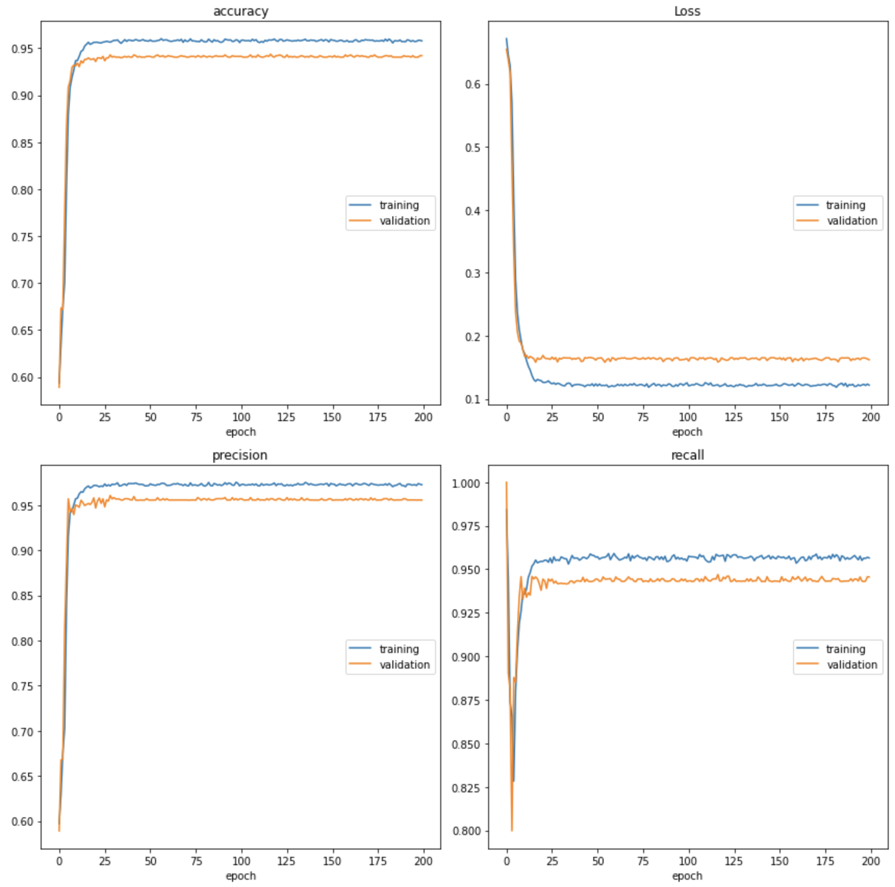

## **Recurrent Neural Network for classification of feedbacks (Russian language)**

1) Use data with feedbacks. You need two columns - text and tone mark
2) Use function **clean()** to preprocess text and **vectorization()** to make a proper
form of text for Tensorflow

```python
df['Текст'] = clean(df['Текст'], normalize_form=True)
vectorize_layer = vectorization(df['Текст'], max_features=5000, max_sequence_length=128)

```

3)  Use **get_train_val_pipeline()** to create Tensorflow datasets. You can choose
split ration and batch_size, shuffling for both train and validation data
    
```python
train_data, valid_data = get_train_val_pipeline(df['Текст'], df['positive'], test_size = 0.2, shuffle_train=True, shuffle_val=True,
                           val_batch_size=128, train_batch_size=128, shuffle_buffer_size = 10000)

```

4) Use **create_model()** to create model. You can define GPU or LSTM architecture 
   of recurrent layers, number of units, bidirectional or not. Also it is possible
   to add Conv1D layer, number of filters and dropout to prevent over-fitting.
   Model uses Adam optimizer with option to set a learning rate
   
```python
model = create_model(vectorize_layer, architecture='GRU', n_rnn_layers=3, rnn_units=256, loss=2e-5, embed_output_dim=256, conv1D=True,
                         conv1D_filters=32, bidirectional=False, dropout=0.5)
```

Training result on 27000 feedbacks about Tinkoff bank. Result on the screen below. Model
was trained on 1 GPU (Tesla K100) with 4 GRU-Bidirectional Layers. Training time with 200 epochs - 
near 3 hours

